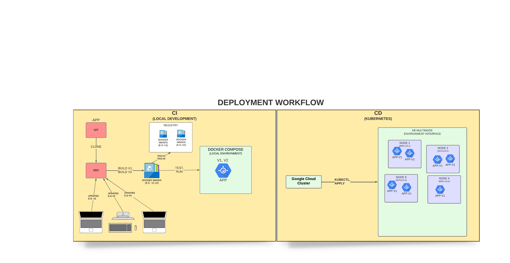

## DIT825 - Software Engineering for Data-Intensive AI Applications

<h1 align="center">Age and Gender Detection</h1> 

### What is the project?

The project is about machine learning to develop a data-intensive AI application. Base on the given requirements and our drawn implications, we have decided to create a age and gender detection application by creating an image classification model. 
Usually we can all discern the age group of a person they belong to, as soon as we look at the face. It is quite easy to say if the person is young, old or middle-aged. In this AI project, we built the age and gender web detector that can approximately 
predict the age and gender of the person (head/face) in an aligned and cropped picture by creating/using a deep learning 
age and gender detection CNN [(Convolutional Neural Network)](https://en.wikipedia.org/wiki/Convolutional_neural_network) model. 

Intended users and few example areas of age and gender detection technology:

* Social media companies,
* Demographic Analysis systems for the companies who use demographic information to understand the characteristics of the people for selling their products and services, 
* Online and physical store solutions,
* Marketing strategies,
* Service improvements,
* Product development

###  Dataset
[UTKFace](https://susanqq.github.io/UTKFace/) dataset is a large-scale face dataset between the age groups up to 116 years-old. The dataset has over approximately 23,700 face images 
with labels of age, gender, and ethnicity. Where _[age]_[gender]_[race]_[date&time].jpg_ :

- Age is an integer from 0 to 116
- Gender is an integer in which 0 represents male and 1 represents female
- Race is an integer from 0 to 4, (0) white, (1) black, (2) asian, (3) indian and (4) others, respectively
- Date and time, denoting when the picture was taken

All the images in the dataset are `aligned and cropped` faces available to train the model, that is to say; a constraint would be that any 
input for testing must be cropped and aligned vertically. The data set has no "NaN" values, so it is a clean dataset.

We look at the distribution of the dataset, it can be seen with the visualization in the notebook that majority of population is between 20 and 30-years-old, according to the distribution of the age groups 
dataset is nor very well-balanced. Training is going to be though and might be tricky to get a good accuracy (now is around 90%). Although, gender distribution (approx. male and female is 50%)
is pretty well-balanced, so we do not need to change gender data. When we look at the race, while white, black, indian and asian have most of the age groups from 0 to 116, other category
do not have the age groups over than 60 as much as the rest of the race categories.

### [CNN](../ModelTrainingService/cnn_model_(self_training).ipynb) Model Architecture

In this project, the input layer is a single input type which are aligned and cropped faces as RGB images, corresponding to red, green and blue channels of an image. 
The neural network is built of three branches (age, gender and ethnicity) which are the features of the images for the prediction and used 2D-convolutional layers(3x)
as set of default hidden layers for the image classification. Stacked as; 

default Hidden layers => Conv2D -> "ReLU" Activation -> BatchNormalization -> MaxPooling -> Dropout.

branch(feature) layers => Dense -> "ReLU" Activation -> Dropout -> followed by the Dense output layera nd softmax(age & ethnicity) / sigmoid(gender) activation layers.

To get multi-output in our model as age and gender, we used keras [image data generator](https://medium.com/@mrgarg.rajat/training-on-large-datasets-that-dont-fit-in-memory-in-keras-60a974785d71) by defining as a helper object. 
This is going to provide us batches of images to support the multi-output model. Image data generator is one of reliable way of handling large datasets to skip the memory problems for training process. 
E.g.: [example 1](https://stackoverflow.com/questions/37981975/memory-error-in-python-when-loading-dataset), 
[example 2](https://stackoverflow.com/questions/53239342/im-getting-a-memory-error-while-processing-my-dataset-in-python-what-could-be), [example 3](https://github.com/keras-team/keras/issues/8939).

### Training the model

In the training phase we adapted Adam optimizer with learning rate 1e-4 for decaying by taking initial learning rate and dividing by the epoch value.
Training phase is still in progress........................................................
..........................................................................................
...........................................................................................
............................................................................................

Accuracy after tuning the layers, trying different architectures and different dynamic learning rate functions and batch sizes has been reached to 90% but there is always room for improvement.

---------------------------------------------------------------------------------------------------------------------------------------------------------

### Diagrams

#### Model Architecture
 

#### Deployment Workflow
 

### Installation
Within a particular ecosystem, there may be a common way of installing things, such as using Yarn, NuGet, or Homebrew. However, consider the possibility that whoever is reading your README is a novice and would like more guidance. Listing specific steps helps remove ambiguity and gets people to using your project as quickly as possible. If it only runs in a specific context like a particular programming language version or operating system or has dependencies that have to be installed manually, also add a Requirements subsection.

### Usage
Use examples liberally, and show the expected output if you can. It's helpful to have inline the smallest example of usage that you can demonstrate, while providing links to more sophisticated examples if they are too long to reasonably include in the README.

### Support
Tell people where they can go to for help. It can be any combination of an issue tracker, a chat room, an email address, etc.

### Roadmap
If you have ideas for releases in the future, it is a good idea to list them in the README.

### Developers

- [Ediz Genc](https://git.chalmers.se/ediz)
- [Michael Araya](https://git.chalmers.se/arayam)
- [Olga Ratushniak](https://git.chalmers.se/olgara)
- [Renyuan Huang](https://git.chalmers.se/renyuan)
- [Zubeen S. Maruf](https://git.chalmers.se/zubeen)

### License
[MIT license](https://git.chalmers.se/courses/dit825/2022/group03/dit825-age-detection/-/blob/main/LICENSE.md)