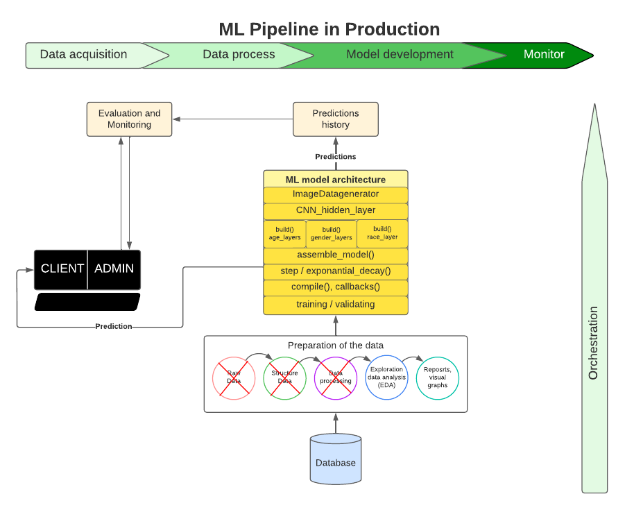

## DIT825 - Software Engineering for Data-Intensive AI Applications

<h1 align="center">Age and Gender Detection</h1> 

### What is the project?

The project is about machine learning to develop a data-intensive AI application. Base on the given requirements and our drawn implications, we have decided to create a age and gender detection application by creating an image classification model. 
Usually we can all discern the age group of a person they belong to, as soon as we look at the face. It is quite easy to say if the person is young, old or middle-aged. In this AI project, we built the age and gender web detector that can approximately 
predict the age and gender of the person (head/face) in an aligned and cropped picture by creating/using a deep learning 
age and gender detection CNN [(Convolutional Neural Network)](https://en.wikipedia.org/wiki/Convolutional_neural_network) model. 

Intended users and few example areas of age and gender detection technology:

* Social media companies,
* Demographic Analysis systems for the companies who use demographic information to understand the characteristics of 
the people for selling their products and services, 
* Online and physical store solutions,
* Marketing strategies,
* Service improvements,
* Product development

###  Dataset
[UTKFace](https://susanqq.github.io/UTKFace/) dataset is a large-scale face dataset between the age groups up to 
116 years-old. The dataset has over approximately 23,700 face images with labels of age, gender, and ethnicity. 
Where _[age]_[gender]_[race]_[date&time].jpg_ :

- Age is an integer from 0 to 116
- Gender is an integer in which 0 represents male and 1 represents female
- Race is an integer from 0 to 4, (0) white, (1) black, (2) asian, (3) indian and (4) others, respectively
- Date and time, denoting when the picture was taken

All the images in the dataset are `aligned and cropped` faces available to train the model, that is to say; a constraint
would be that any input for testing must be cropped and aligned vertically. The data set has no "NaN" values, so it is 
a clean dataset.

When we look at the distribution of the dataset, it can be seen with the visualization in the notebook that majority of 
population is between 20 and 30-years-old, according to the distribution of the age group dataset is not very well-balanced. Although, gender distribution
is pretty well-balanced, so we do not need to change gender data. When we look at the race, while white, black, indian and asian have most of the age groups from 0 to 116, other category
do not have the age groups over than 60 as much as the rest of the race categories.

### [CNN](../ModelTrainingService/cnn_model_(self_training).ipynb) Model Architecture

In the project, we have built multiclass classification models in python by using tensorflow and Keras libraries by 
constructing of a convolutional neural network (CNN) to make an image classification model to classify images based 
on the person's age & gender. The input layer is a single input type which are aligned and cropped faces as RGB images, 
corresponding to red, green and blue channels of an image.

The neural network is built of three layered_block branches (age, gender and ethnicity) which are the features of images
for the prediction and used 2D-convolutional layers as set of default hidden layers for the image classification. 
Stacked as; 

default Hidden layers => Conv2D -> "ReLU" Activation -> BatchNormalization -> MaxPooling -> Dropout.

branch(feature) layers => Dense -> "ReLU" Activation -> Dropout -> followed by the Dense output layers and softmax 
activation layers for all features.

To get multi-output in our model as age and gender, we used keras [image data generator](https://medium.com/@mrgarg.rajat/training-on-large-datasets-that-dont-fit-in-memory-in-keras-60a974785d71) by defining as a helper object. 
This is going to provide us batches of images to support the multi-output model. Image data generator is one of reliable way of handling large datasets to skip the memory problems for training process. 
E.g.: [example 1](https://stackoverflow.com/questions/37981975/memory-error-in-python-when-loading-dataset), 
[example 2](https://stackoverflow.com/questions/53239342/im-getting-a-memory-error-while-processing-my-dataset-in-python-what-could-be), [example 3](https://github.com/keras-team/keras/issues/8939).

#### Model Architecture
 

### Training the model

In the training phase we adapted Adam optimizer with learning rate 1e-4 for decaying by taking initial learning rate and dividing by the epoch value.

(to be continued...)

Accuracy after tuning the layers, trying different architectures and different dynamic learning rate functions and batch sizes has been reached to 90% but there is always room for improvement.

### Efficiency
After realizing the fact that the accuracy and validation accuracy are so far apart from each other suggests that our model was heavily over-training. Generally speaking we wanted to have 
a model where accuracy and validation accuracy are both close to each other. Even worse, when the discrapency between loss and validation_loss was dramatic and validation_loss was unstable and increasing
as the experiment progress epoch-by-epoch. This was one of the thing we wanted to focus for training a model and the time for learning a little bit about over-training and under-training and how to 
deal with those situations.

According to noted some sources in the training notebook;

-  a low accuracy and huge loss means you made huge errors on a lot of data
-  a low accuracy but low loss means you made little errors on a lot of data
-  a great accuracy with low loss means you made low errors on a few data (best case)

one of the crucial step we have been trying to achieve was with a high accuracy with low loss values while trying keep en eye on the dozens of training sessions which was created from different architecture layers/blocks 
in hidden layer as well as in feature layers. Accuracy in classification models is to inform about what is the level of models predictions. 

At the first glance, mindset of accuracy values on models as below enabled us to determine if our model is good enough. If the accuracy is;

Note: Below are the acceptable/non-objectionable accuracy value results in ML
- lower than 60%, do a new model.
- between 60% and 70%, it’s a poor model.
- between 70% and 80%, you’ve got a good model.
- between 80% and 90%, you have an excellent model.
- between 90% and 100% (it’s a probably an overfitting case).

We have been learned that trusting accuracy alone is not a good way of evaluate how well the model performs, expecielly for imbalanced dataset(df['age']). Accuracy is just one of the first 
and simple way of measurement for the effectiveness of the model, misleading can happen a lot. For this reason, we have decided to use some 
efficiency graph plots with a clear diagnostic ability such as AUC(ROC curve) with a baseline origo linear (auc=%50).

Overfitting refers to a model that was trained too much on the particulars of the training data (when the model learns the noise in the dataset).  A model that is overfit will not perform well on new, unseen data.  Overfitting is arguably the most common problem in applied machine learning and is especially troublesome because a model that appears to be highly accurate will actually perform poorly in the wild.

Types of cross-entropy:

Binary cross-entropy: for binary classification problem
Categorical cross-entropy: binary and multiclass problem, the label needs to be encoded as categorical, one-hot encoding representation (for 3 classes: [0, 1, 0], [1,0,0]…)
Sparse cross-entropy: binary and multiclass problem (the label is an integer — 0 or 1 or … n, depends on the number of labels)
Range of values for this class of Loss function:

Note: Below are the acceptable/non-objectionable loss value results in ML
0.00: Perfect probabilities
< 0.02: Great probabilities
< 0.05: In a good way
< 0.20: Great
> 0.30: Not great
>1.00: Hell
> 2.00 Something is not working

Source: https://towardsdatascience.com/regularization-in-deep-learning-l1-l2-and-dropout-377e75acc036
The L2 regularization is the most common type of all regularization techniques and is also commonly known as weight decay or Ride Regression.

Since L2 regularization takes the square of the weights, it’s classed as a closed solution. L1 involves taking the absolute values of the weights, meaning that the solution is a non-differentiable piecewise function or, put simply, it has no closed form solution. L1 regularization is computationally more expensive, because it cannot be solved in terms of matrix math. 

The right number of epochs depends on the inherent perplexity (or complexity) of your dataset. A good rule of thumb is to start with a value that is 3 times the number of columns in your data. If you find that the model is still improving after all epochs complete, try again with a higher value.

Performing L2 regularization encourages the weight values towards zero (but not exactly zero)
Performing L1 regularization encourages the weight values to be zero
Intuitively speaking smaller weights reduce the impact of the hidden neurons. In that case, those hidden neurons become neglectable and the overall complexity of the neural network gets reduced.

Smaller weight parameters make some neurons neglectable → neural network becomes less complex → less overfitting
During dropout, some neurons get deactivated with a random probability P → Neural network becomes less complex → less overfitting.

For a diagnostic test to be meaningful, the AUC must be greater than 0.5. Generally, an AUC ≥ 0.8 is considered acceptable.
An AUC ROC (Area Under the Curve Receiver Operating Characteristics) plot can be used to visualize a model’s performance between sensitivity and specificity. Sensitivity refers to the ability to correctly identify 
entries that fall into the positive class. Specificity refers to the ability to correctly identify entries that fall into the negative class. Put another way, an AUC ROC plot can help you identify how well your model is able to distinguish between classes.

(to be continued...)

#### Deployment Workflow
 

### Installation
Within a particular ecosystem, there may be a common way of installing things, such as using Yarn, NuGet, or Homebrew. However, consider the possibility that whoever is reading your README is a novice and would like more guidance. Listing specific steps helps remove ambiguity and gets people to using your project as quickly as possible. If it only runs in a specific context like a particular programming language version or operating system or has dependencies that have to be installed manually, also add a Requirements subsection.

### Usage
Use examples liberally, and show the expected output if you can. It's helpful to have inline the smallest example of usage that you can demonstrate, while providing links to more sophisticated examples if they are too long to reasonably include in the README.

### Support
Tell people where they can go to for help. It can be any combination of an issue tracker, a chat room, an email address, etc.

### Roadmap
If you have ideas for releases in the future, it is a good idea to list them in the README.

### Developers

- [Ediz Genc](https://git.chalmers.se/ediz)
- [Michael Araya](https://git.chalmers.se/arayam)
- [Olga Ratushniak](https://git.chalmers.se/olgara)
- [Renyuan Huang](https://git.chalmers.se/renyuan)
- [Zubeen S. Maruf](https://git.chalmers.se/zubeen)

### License
[MIT license](https://git.chalmers.se/courses/dit825/2022/group03/dit825-age-detection/-/blob/main/LICENSE.md)
